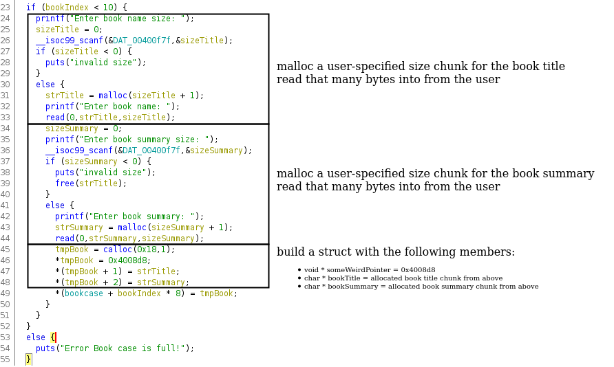
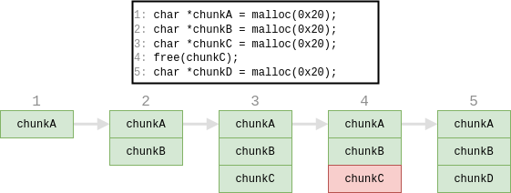
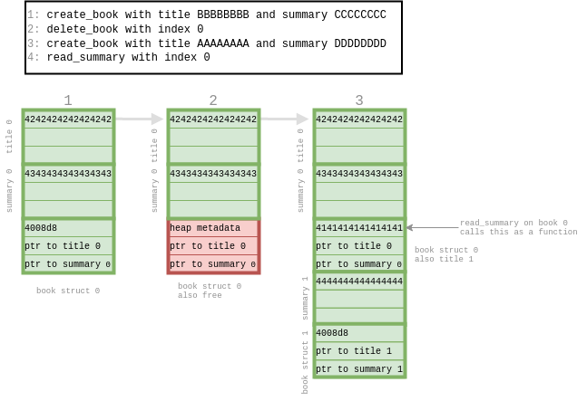
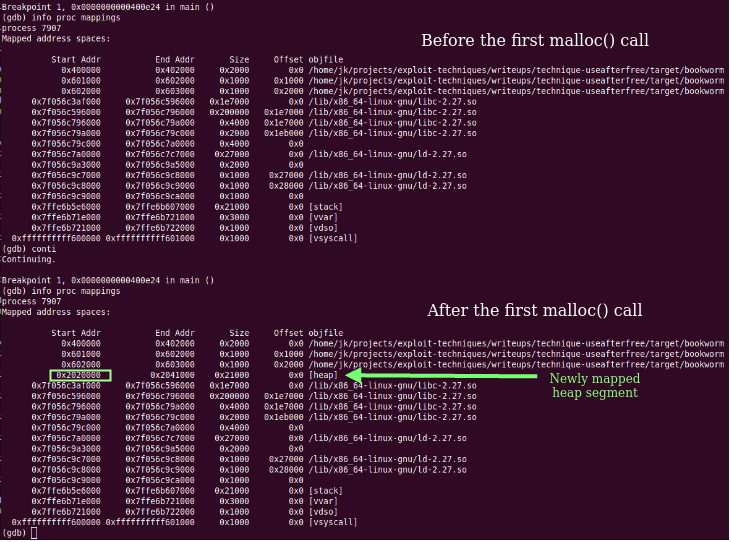

# use after free

This writeup describes the exploitation of a "use after free" vulnerability in the heap management of a target program.  This vulnerability typically occurs when a heap chunk is allocated with an intended use-case (ex: hardcoded function pointer), free'd, allocated again and modified for a different purpose (ex: user-controlled string buffer), but still (mistakenly) seen as a valid chunk for that original use-case.  Weaponizing of these vulnerabilities is pretty dependent on the program itself and the data structures of the before and after views into these chunks.  Exploiting these vulnerabilities does not necessarily rely on corrupting heap metadata like other heap expoitation techniques (double free, for example).  In this way, exploiting these vulnerability has a similar target-specific feel as buffer overflowing local variables on the stack (without corrupting a return pointer or saved frame pointer).

## the target

The target for this writeup is the **bookworm** problem from [HackPack CTF 2020](https://hackpack.club/).  I chose this problem because it is a very nice barebones example of exploiting a use after free.  Grab the files below to get started (archived in this repo):

bookworm (494 points) - *Bookworm: a book collection service.  nc cha.hackpack.club 41720*
  * [bookworm](target/bookworm)
  * [libc.so.6](target/libc.so.6)

While the CTF was running you could `nc cha.hackpack.club 55555` to remotely connect to the running target service and interact with it by selecting menu options and reading the output that came back.  It's always a good idea to just see what normal program behavior looks like before diving into bughunting.  Although the CTF is over and that service is no longer listening anymore, we can host the service ourselves using socat (`apt-get install socat`) and simulate the actual target that way:

 `socat TCP-LISTEN:2323,reuseaddr,fork EXEC:"./bookworm"`

This will create a TCP port 2323 listener on your system that forks everytime a connection is made to it by a client, execute the `bookworm` binary, and connect the relevant pipes together.  The effect of this is that clients can connect to `bookworm` and interact with it as if it were being run from the terminal.  This is common way to host CTF problems because it allows writing challenges using stdin/stdout instead of having to deal with sockets and networking.  Now that we have it set up, you can connect to it in the standard way using netcat:

`nc localhost 2323`

Once you're able to repeatably connect and interact with the service, play around with the menus to figure out what this program does.  Remember, this is not the time for foolishness; for now just understand what the program does under normal conditions.


## analysis

In the context of CTF problems, the menu-based interface of this program should have you immediately thinking "this might be a heap thing".  The reason is that heap vulnerabilities typically require you create, free, and modify heap chunks in a specific order; this means that menu-driven interfaces are good fit for demonstrating this class of vulnerabilities.  Real-world binaries are much more complex than typical CTF problems so they get their client-control-over-operation-ordering from that complexity whereas CTF problems use a menu-interface to sort of simulate that complexity.  For this reason, menu-driven interfaces often indicate heap vulnerabilities in CTF problems...except when they don't ;-p

Before you start reversing engineering the target, it's a good idea to see what architecture it's built for and what exploit mitigations it employs.  I use the `file` command to get a quick overview of the binary and then [`checksec`](https://github.com/slimm609/checksec.sh) to see the various protections that it uses (these are all gcc flags during build).  This case, we see that PIE is disabled, stack canaries are enabled, and NX is enabled.  PIE (position-independent executable) being disabled means that our target's program image will always load at the same address every run (even under ASLR).  This is important because it means that we can hardcode any address that is in the program itself's segments (.text, .data, PLT, GOT, etc..).

Some folks like to drive straight into trying to make the program crash by fiddling with menu or by fuzzing.  I prefer to check out some of the core functions first.  For this, I'll be using Ghidra but any disassembler will work.  After taking a quick look through main to make sure the menu works like I expect and there aren't any hidden options, I check out create_book:



After renaming variables to clean up Ghidra's decompilation, we take an early look for issues.  Ignoring any off-by-one errors that may be hanging around, the allocations and reads for the book title and summary both look safe.  The chunk size and maximum read length are the same which means no buffer overflow there.  Everything looks pretty normal except that weird book struct and especially that weird hardcoded `0x4008d8` pointer in its first member variable.  That looks like a .text segment address (like a function) so let's go see what that is...


Hey look at that; it's a function pointer to the `display_summary` function.  This is a clue that the `4) Read Book Summary` option may use this function pointer in this book struct to decide how to read book summaries on a per-book basis.  The function itself is very simple; it just calls `puts` with the function's first (and only) argument.  Let's confirm that this option does, in fact, use this pointer...


Everything is as we expect; that harcoded function pointer to `display_summary` in the book struct gets called by `read_summary` when it is executed by selecting the `4) Read Book Summary` option from the menu.  Remember that the book struct containing this function pointer is stored on the heap in a chunk that got `calloc`'d by the `create_book` function.  If we could find a way to overwrite this function pointer and then select option 4, we could send execution anywhere we want to.  This is our new goal...

## the vulnerability

Earlier we saw a sequence of three allocation functions being called in a row by `create_book` with the final book struct being built in the 3rd chunk and global `bookcase` array (at the book id index) being updated to point at it.  Before reading a book, the `read_summary` function checks this book struct pointer in `bookcase` to ensure that the requested book struct pointer isn't null (this cooresponds to the user trying to read a book that was never created in the first place).  But what if we create a book, delete it, and then try to read it?  Presumably, the delete_book function frees the chunks associated with the selected book and then nulls out the cooresponding book struct pointer in `bookcase`, right?  Let's check out `delete_book` and see...


Huh? This delete function is pretty lazy compared to what we expected to find.  It should be free'ing the chunks for the book's title and summary but it's only free'ing the overall book struct that points to them.  This lack of cleanup isn't necessarily a vulnerability but it indicates that maybe we look a bit further.  Notice that: **the `delete_book` function does not invalidate the bookcase entry for a free'd book** struct by writing over that `bookcase` array entry with null.  This means that the `read_summary` function has no way to know if a book struct has been free'd before calling that function pointer inside it.  This is the "use after free" vulnerability itself.  The `read_summary` function still thinks this chunk exists and trusts it enough to call a function pointer inside it even though its been free'd.  Next we're going to take advantage of that chunk being free to overwrite that function pointer.

## heap chunk allocation

The standard heap in linux for C programs called **glibc malloc**; this is confusing because `malloc` is also a function that is one small part of the overall `glibc malloc` heap system (which includes `free`, `realloc`, `calloc`, and a lot of internals that make the whole thing function).  There are several ways in which memory is selected by the heap for allocation and several ways that chunks are free'd and tracked to make subsequent allocations faster and more memory-efficient.  Adjacent chunks are coalesced together to make larger chunks according to some internal glibc malloc logic.  Heap internals are a deep rabbit hole that we don't have to dive into to exploit this use-after-free vulnerability.  Instead, we remember a rule of thumb: **if possible, new allocations of the some size want to slot in on top of previously-free'd chunks of that size.**  That means that, in general, if we malloc a chunk A of size 0x20, free it, and then malloc another chunk D of size 0x20: chunk A and chunk D will both be pointing to the same memory.



There is another minor aspect of heap mechanics that we can learn now: **the minimize chunk size in x86_64 is 0x20 bytes with 0x18 usable**.  This just means that calls like `malloc(8)` will still work but the real useable chunk size is 24 bytes and our requested 8 bytes resides at the start of the chunk (as usual).  The extra 0x8 bytes of the 0x20 byte total is metadata about the allocated chunk (its size and some flags) that lives just before the useable data.  **None of the diagrams in this writeup include this chunk size metadata** because it is not relevant to this technique and is at a lower level of abstraction than we require.

## exploit concept

For this target, we know that deleting books really just `free`s that book's struct; its title and summary chunks stay allocated. Additionally, the pointer to that book struct in the bookcase doesn't get null'd out so its still valid.  This means that we can attempt to read deleted books.  Reading books means that the book struct's function pointer gets called.  This function pointer lives in a `free`d chunk (the deleted book struct) which makes it a candidate for allocation (and overwriting).  We just need to find a way to allocate a chunk of the same size as book struct (0x18 bytes) and overwrite it.  For this purpose, we can just create a new book; this triggers 3 new allocations in a row (book title, book summary, and book struct).  In theory the first allocation (book title) should allocate on top of our free'd-but-still-useable original book struct chunk.  So, in summary: create a book, free it, create a book (with title `AAAAAAAAA` for now).



This has the effect that the program has two interpretations of the same chunk of memory.  From the `read_summary` function's perspective, the chunk containing book 0's book struct is still valid and contains a valid function pointer to call.  From `create_book`'s perspective, that exact same chunk is free so it can allocate it and write a user-controlled book title string in there.  This has the effect of overwriting the original function pointer with `0x41414141414141`.  Then we'll call that overwritten function pointer by reading book 0.  In the next section, we'll use gdb to verify and see what all of this looks like in memory.

## harnessing with pwntools

In order to examine memory while running the target binary, we'll be using raw off-the-shelf gdb.  I will assume some familiarity with gdb and debugging in general for this writeup.  If you have a favorite `.gdbinit`, feel free to use it; I personally like [`pwndbg`](https://github.com/pwndbg/pwndbg), but this writeup will generally avoid relying on features specific to these gdb enhancements.  You can drive straight in with gdb itself and manually provide input to the target using your keyboard but we can do better.  We're going to build a [harness](solution/helper.py) in python that will allow us to programmatically provide input to and read output from the target while its running.  Additionally, this harness will allow us to easily switch between running in gdb, running normally locally, and connecting to the "real" target over the network.

The library that we will use to help us is [`pwntools`](https://github.com/Gallopsled/pwntools).  This thing is an awesome python swiss-army knife for exploit development takes a lot of the drudgery out of weaponizing vulnerabilities.  We can use `gdb.debug('./target/bookworm')` to launch an instance of bookworm under gdb.  By passing this function an additional argument, we can control what commands are fed to that gdb instance (in this case, we set a breakpoint).  The script then uses a series of `sendafter(expectString, responseString)` calls to programmatically interact with the debugged bookworm process.  The `sendafter` function reads characters from the stdout of the bookworm process until it sees the entire `expectString` (first argument).  When this condition is met, it sends `responseString` (second argument) to the bookworm process's stdin.  Finally, pwntools can hand off control back to the terminal/keyboard/user by calling the `interactive` function; this is especially useful when you trigger a shell at the end of an exploit and actually want to use it interactively instead of programmatically.

```
from pwn import *

app = gdb.debug('./target/bookworm', 'break *0x00400e24\ncontinue')

app.sendafter('>> ', '1\n')
app.sendafter('Enter book name size: ', '8\n')
app.sendafter('Enter book name: ', 'BBBBBBBB\n')
app.sendafter('Enter book summary size: ', '8\n')
app.sendafter('Enter book summary: ', 'CCCCCCCC\n')

app.sendafter('>> ', '2\n')
app.sendafter('Select Book ID (0-10): ', '0\n')

app.sendafter('>> ', '1\n')
app.sendafter('Enter book name size: ', '8\n')
app.sendafter('Enter book name: ', 'AAAAAAAA')
app.sendafter('Enter book summary size: ', '8\n')
app.sendafter('Enter book summary: ', 'DDDDDDDD\n')

app.sendafter('>> ', '4\n')
app.sendafter('Select Book ID (0-10): ', '0\n')

app.interactive()

```

Remember that breakpoint mentioned earlier at `0x00400e24`?  If you check it out in Ghidra, you'll see that this address is where the main menu loop begins.  By setting gdb to break here, every time our harness selects a menu option, we'll get a chance to stop and look around at the heap and program state after it completes that step.

## examining the heap in gdb

Lets run the [harness script](solution/helper.py) above and see what happens.  It should create a new terminal window with your gdb instance running `bookworm` and stopped at `0x00400e24`.  At this stage, nothing has happened yet and there is no heap segment even mapped into memory.  Check out the process address space with `info proc mappings` or `!cat /proc/$(pidof bookworm)/maps` or `vmmap` (pwndbg only) and you'll see that there is no heap segment for bookworm.  The heap doesn't get create in a process until the first call to `malloc`, `calloc`, etc..  So let's use the `continue` command to proceed with execution.  This will cause our harness to advance as bookworm feeds it output and asks it for input.  Our harness selects option 1 to create a new book and gives it a title of `BBBBBBBB` and a summary of `CCCCCCCC`.  The menu interface loops around and stops on our breakpoint at `0x00400e24` again.  Run `info proc mappings` again and you'll see that we now have a heap segment; note it's starting address.



Now that we have a heap and have some chunks allocated on it, lets go look at them!  We can use the normal examine commands to do this or, if you're fancy, you can use the `vis_heap_chunks` command (pwndbg only).  We need to use that `[heap]` starting address that we found because ASLR will randomize it every run; in my case, for this run, I got a heap start address of `0x2020000`.  I will examine these new chunks by running `x/100gx 0x2020000`.  You can locate chunks in this hex dump by looking for the `0x0000000000000021` chunk metadata that we are otherwise ignoring.  The size of the chunk (including the extra 8 bytes of this metadata itself) is stored in this field with the least-significant nibble used for flags (thats why its 0x21 instead of 0x20, the 0x1 is a flag that indicates an "in-use" chunk).  We aren't interested in this metadata but we can use it to locate our chunk boundaries.


