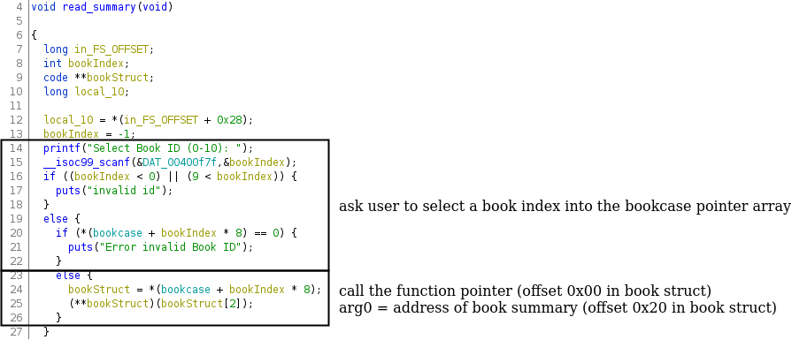
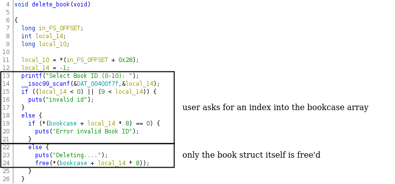

# use after free

This writeup describes the exploitation of a "use after free" vulnerability in the heap management of a target program.  This vulnerability typically occurs when a heap chunk is allocated with an intended use-case (ex: hardcoded function pointer), free'd, allocated again and modified for a different purpose (ex: user-controlled string buffer), but still (mistakenly) seen as a valid chunk for that original use-case.  Weaponizing of these vulnerabilities is pretty dependent on the program itself and the data structures of the before and after views into these chunks.  Exploiting these vulnerabilities does not necessarily rely on corrupting heap metadata like other heap expoitation techniques (double free, for example).  In this way, exploiting these vulnerability has a similar target-specific feel as buffer overflowing local variables on the stack (without corrupting a return pointer or saved frame pointer).

## the target

The target for this writeup is the **bookworm** problem from [HackPack CTF 2020](https://hackpack.club/).  I chose this problem because it is a very nice barebones example of exploiting a use after free.  Grab the files below to get started (archived in this repo):

bookworm (494 points) - *Bookworm: a book collection service.  nc cha.hackpack.club 41720*
  * [bookworm](target/bookworm)
  * [libc.so.6](target/libc.so.6)

While the CTF was running you could `nc cha.hackpack.club 55555` to remotely connect to the running target service and interact with it by selecting menu options and reading the output that came back.  It's always a good idea to just see what normal program behavior looks like before diving into bughunting.  Although the CTF is over and that service is no longer listening anymore, we can host the service ourselves using socat (`apt-get install socat`) and simulate the actual target that way:

 `socat TCP-LISTEN:2323,reuseaddr,fork EXEC:"./bookworm"`

This will create a TCP port 2323 listener on your system that forks everytime a connection is made to it by a client, execute the `bookworm` binary, and connect the relevant pipes together.  The effect of this is that clients can connect to `bookworm` and interact with it as if it were being run from the terminal.  This is common way to host CTF problems because it allows writing challenges using stdin/stdout instead of having to deal with sockets and networking.  Now that we have it set up, you can connect to it in the standard way using netcat:

`nc localhost 2323`

Once you're able to repeatably connect and interact with the service, play around with the menus to figure out what this program does.  Remember, this is not the time for foolishness; for now just understand what the program does under normal conditions.

## analysis

In the context of CTF problems, the menu-based interface of this program should have you immediately thinking "this might be a heap thing".  The reason is that heap vulnerabilities typically require you create, free, and modify heap chunks in a specific order; this means that menu-driven interfaces are good fit for demonstrating this class of vulnerabilities.  Real-world binaries are much more complex than typical CTF problems so they get their client-control-over-operation-ordering from that complexity whereas CTF problems use a menu-interface to sort of simulate that complexity.  For this reason, menu-driven interfaces often indicate heap vulnerabilities in CTF problems...except when they don't ;-p

Some folks like to drive straight into trying to make the program crash by fiddling with menu or by fuzzing.  I prefer to check out some of the core functions first.  For this, I'll be using Ghidra but any disassembler will work.  After taking a quick look through main to make sure the menu works like I expect and there aren't any hidden options, I check out create_book:

After renaming variables to clean up Ghidra's decompilation, we take an early look for issues.  Ignoring any off-by-one errors that may be hanging around, the allocations and reads for the book title and summary both look safe.  The chunk size and maximum read length are the same which means no buffer overflow there.  Everything looks pretty normal except that weird book struct and especially that weird hardcoded `0x4008d8` pointer in its first member variable.  That looks like a .text segment address (like a function) so let's go see what that is...

Hey look at that; it's a function pointer to the `display_summary` function.  This is a clue that the `4) Read Book Summary` option may use this function pointer in this book struct to decide how to read book summaries on a per-book basis.  The function itself is very simple; it just calls `puts` with the function's first (and only) argument.  Let's confirm that this option does, in fact, use this pointer...

Everything is as we expect; that harcoded function pointer to `display_summary` in the book struct gets called by `read_summary` when it is executed by selecting the `4) Read Book Summary` option from the menu.  Remember that the book struct containing this function pointer is stored on the heap in a chunk that got `calloc`'d by the `create_book` function.  If we could find a way to overwrite this function pointer and then select option 4, we could send execution anywhere we want to.  This is our new goal...

## the vulnerability

Earlier we saw a sequence of three allocation functions being called in a row by `create_book` with the final book struct being built in the 3rd chunk and global `bookcase` array (at the book id index) being updated to point at it.  Before reading a book, the `read_summary` function checks this book struct pointer in `bookcase` to ensure that the requested book struct pointer isn't null (this cooresponds to the user trying to read a book that was never created in the first place).  But what if we create a book, delete it, and then try to read it?  Presumably, the delete_book function frees the chunks associated with the selected book and then nulls out the cooresponding book struct pointer in `bookcase`, right?  Let's check out `delete_book` and see...

Huh? This delete function is pretty lazy compared to what we expected to find.  It should be free'ing the chunks for the book's title and summary but it's only free'ing the overall book struct that points to them.  This lack of cleanup isn't necessarily a vulnerability but it indicates that maybe we look a bit further.  Notice that: _the `delete_book` function does not invalidate the bookcase entry for a free'd book_ struct by writing over that `bookcase` array entry with null.  This means that the `read_summary` function has no way to know if a book struct has been free'd before calling that function pointer inside it.  This is the "use after free" vulnerability itself.

