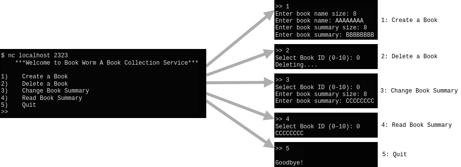

# use after free

This writeup describes the exploitation of a "use after free" vulnerability in the heap management of a target program.  This vulnerability typically occurs when a heap chunk is allocated with an intended use-case (ex: hardcoded function pointer), free'd, allocated again and modified for a different purpose (ex: user-controlled string buffer), but still (mistakenly) seen as a valid chunk for that original use-case.  Weaponizing of these vulnerabilities is pretty dependent on the program itself and the data structures of the before and after views into these chunks.  Exploiting these vulnerabilities does not necessarily rely on corrupting heap metadata like other heap expoitation techniques (double free, for example).  In this way, exploiting these vulnerability has a similar target-specific feel as buffer overflowing local variables on the stack (without corrupting a return pointer or saved frame pointer).

## the target

The target for this writeup is the **bookworm** problem from [HackPack CTF 2020](https://hackpack.club/).  I chose this problem because it is a very nice barebones example of exploiting a use after free.  Grab the files below to get started (archived in this repo):

bookworm (494 points) - *Bookworm: a book collection service.  nc cha.hackpack.club 41720*
  * [bookworm](target/bookworm)
  * [libc.so.6](target/libc.so.6)

While the CTF was running you could `nc cha.hackpack.club 55555` to remotely connect to the running target service and interact with it by selecting menu options and reading the output that came back.  It's always a good idea to just see what normal program behavior looks like before diving into bughunting.  Although the CTF is over and that service is no longer listening anymore, we can host the service ourselves using socat (`apt-get install socat`) and simulate the actual target that way:

 `socat TCP-LISTEN:2323,reuseaddr,fork EXEC:"./bookworm"`

This will create a TCP port 2323 listener on your system that forks everytime a connection is made to it by a client, execute the `bookworm` binary, and connect the relevant pipes together.  The effect of this is that clients can connect to `bookworm` and interact with it as if it were being run from the terminal.  This is common way to host CTF problems because it allows writing challenges using stdin/stdout instead of having to deal with sockets and networking.  Now that we have it set up, you can connect to it in the standard way using netcat:

`nc localhost 2323`

Once you're able to repeatably connect and interact with the service, play around with the menus to figure out what this program does.  Remember, this is not the time for foolishness; for now just understand what the program does under normal conditions.

 
